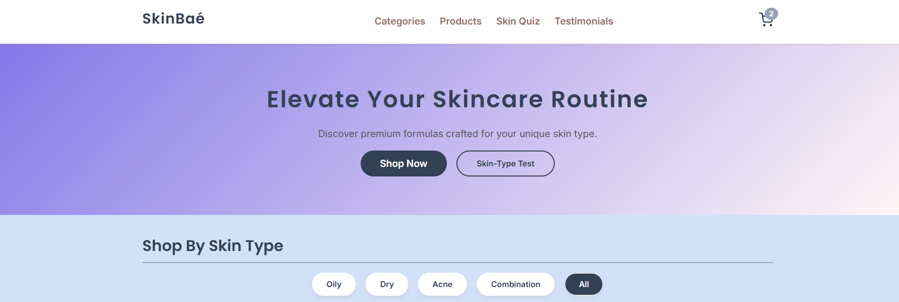
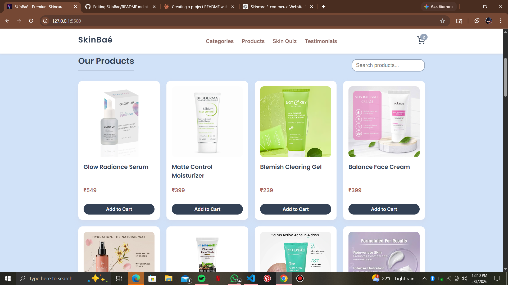
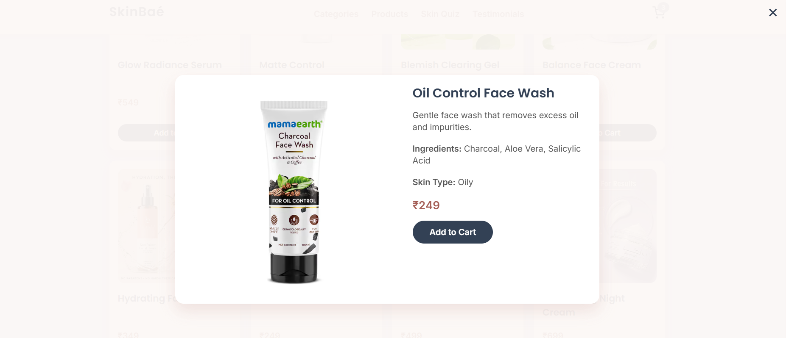
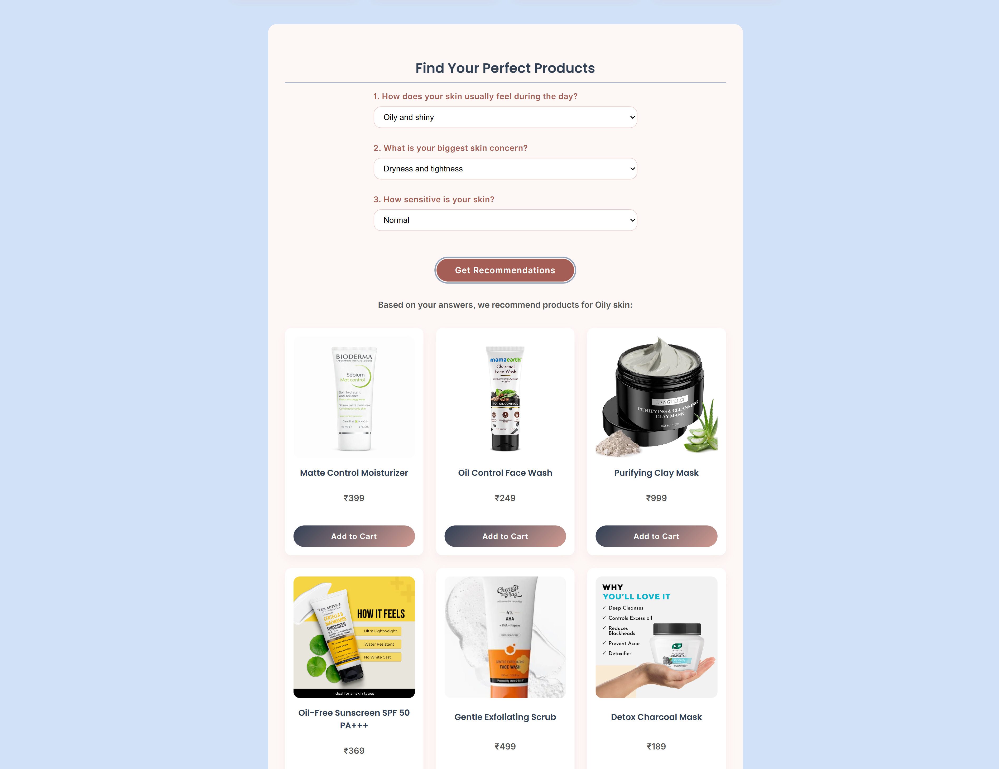
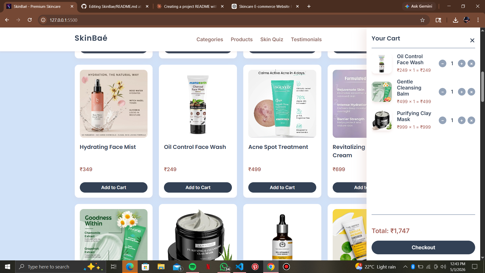
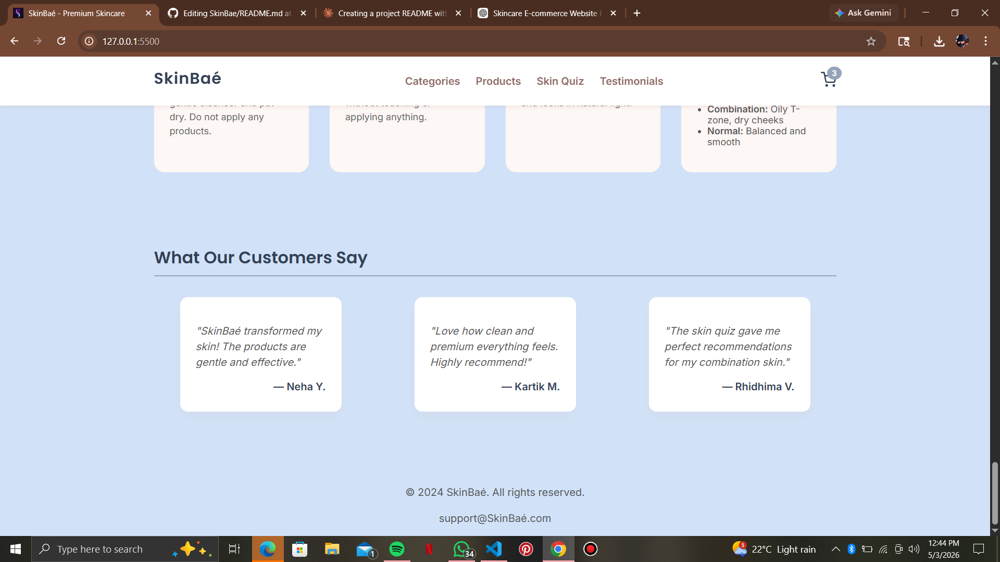

# SkinBaé - Premium Skincare E-Commerce Website


A modern, responsive e-commerce platform for premium skincare products with intelligent skin-type recommendations and an interactive shopping experience.

## 📸 Screenshots

### Homepage

*Add screenshot of the hero section with "Elevate Your Skincare Routine" heading*

### Product Catalog

*Add screenshot of the product catalog with category filters*

### Product Details Modal

*Add screenshot of the product details modal showing ingredients and description*

### Skin Type Quiz

*Add screenshot of the skin type quiz section*

### Shopping Cart

*Add screenshot of the cart sidebar with products*

### Bare Face Method

*Add screenshot of the Bare Face Method section*

### Testimonials

*Add screenshot of the Bare Face Method section*

## ✨ Features

### 🛍️ Shopping Experience
- **Dynamic Product Catalog**: Browse 20 curated skincare products
- **Smart Filtering**: Filter products by skin type (Oily, Dry, Acne-Prone, Combination)
- **Real-time Search**: Instant search across product names and descriptions
- **Product Details Modal**: View comprehensive product information, ingredients, and pricing

### 🎯 Personalization
- **Skin Type Quiz**: Interactive 3-question quiz to identify your skin type
- **Personalized Recommendations**: Get product suggestions based on quiz results
- **Bare Face Method Guide**: Step-by-step guide to determine your skin type at home

### 🛒 Shopping Cart
- **Persistent Cart**: Cart data saved in localStorage
- **Quantity Management**: Easy increment/decrement controls
- **Real-time Total Calculation**: Automatic price updates
- **Slide-out Sidebar**: Sleek cart interface with smooth animations

### ♿ Accessibility
- **ARIA Labels**: Comprehensive screen reader support
- **Keyboard Navigation**: Full keyboard accessibility
- **Focus Management**: Clear focus indicators
- **Semantic HTML**: Proper heading hierarchy and landmarks

### 📱 Responsive Design
- Mobile-first approach
- Optimized for all screen sizes
- Touch-friendly interactions
- Adaptive grid layouts

## 🎨 Design Highlights

- **Color Palette**: Soothing blues and warm terracotta tones
- **Typography**: 
  - Headings: Poppins (600)
  - Body: Inter (400, 600)
- **Visual Effects**:
  - Smooth hover transitions
  - Card elevation shadows
  - Gradient backgrounds
  - Toast notifications

## 🚀 Technologies Used

- **HTML5**: Semantic markup
- **CSS3**: 
  - CSS Grid & Flexbox
  - Custom properties
  - Animations & Transitions
  - Media queries
- **Vanilla JavaScript**: 
  - ES6+ features
  - LocalStorage API
  - DOM manipulation
  - Event handling

## 📁 Project Structure

```
skinbae/
│
├── index.html          # Main HTML structure
├── style.css           # Complete styling
├── script.js           # Application logic
├── SkinBaé.png        # Logo/favicon
├── README.md          # This file
│
└── screenshots/       # Create this folder for screenshots
    ├── homepage-hero.png
    ├── product-grid.png
    ├── product-modal.png
    ├── skin-quiz.png
    ├── shopping-cart.png
    ├── testimonials.png
    └── bareface-method.png
```

## 📋 How to Use

1. **Browse Products**
   - Scroll to the "Our Products" section
   - Use category filters to narrow down options
   - Search for specific products using the search bar

2. **View Product Details**
   - Click on any product card to see detailed information
   - Review ingredients, skin type compatibility, and pricing

3. **Take the Skin Quiz**
   - Navigate to the "Skin Quiz" section
   - Answer 3 simple questions
   - Get personalized product recommendations

4. **Try the Bare Face Method**
   - Click "Skin-Type Test" in the hero section
   - Follow the 4-step guide to identify your skin type at home

5. **Add to Cart**
   - Click "Add to Cart" on any product
   - View cart by clicking the cart icon (top-right)
   - Adjust quantities or remove items
   - See real-time total calculation


## 🌟 Product Categories

- **Dry Skin**: 6 hydrating products (serums, mists, cleansers)
- **Oily Skin**: 6 oil-control products (cleansers, masks, sunscreens)
- **Acne-Prone**: 5 targeted treatments (gels, serums, spot treatments)
- **Combination**: 5 balancing products (creams, toners, moisturizers)

## 💡 Future Enhancements

- [ ] User authentication & accounts
- [ ] Wishlist functionality
- [ ] Product reviews & ratings
- [ ] Advanced filtering (price range, ingredients)
- [ ] Multi-language support
- [ ] Payment gateway integration
- [ ] Order tracking
- [ ] Email notifications

## 📝 License

This project is open source and available for educational purposes.

---

**Made with ❤️ for skincare enthusiasts**
